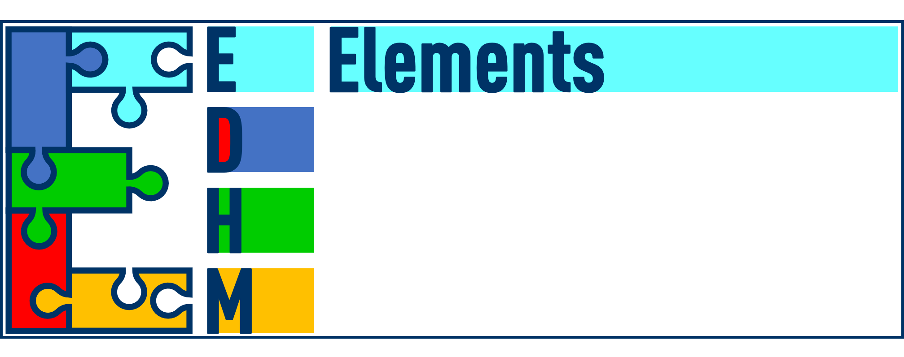
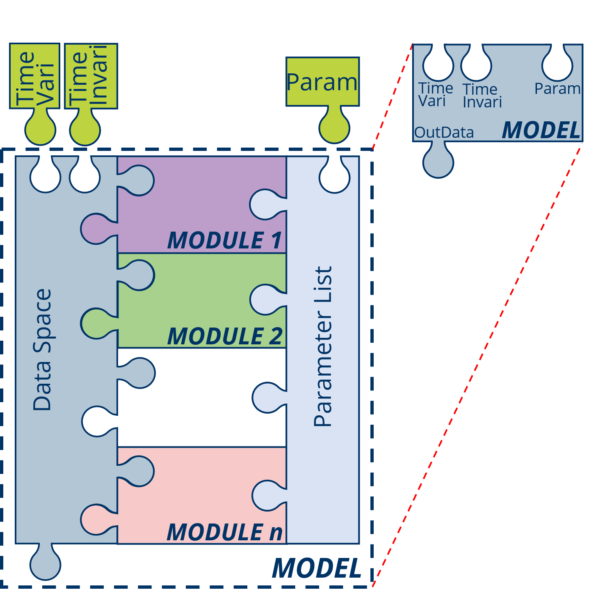
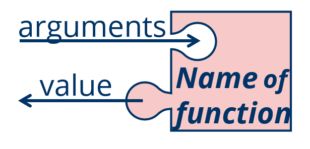
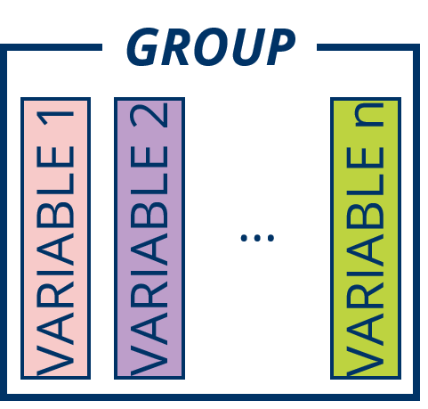
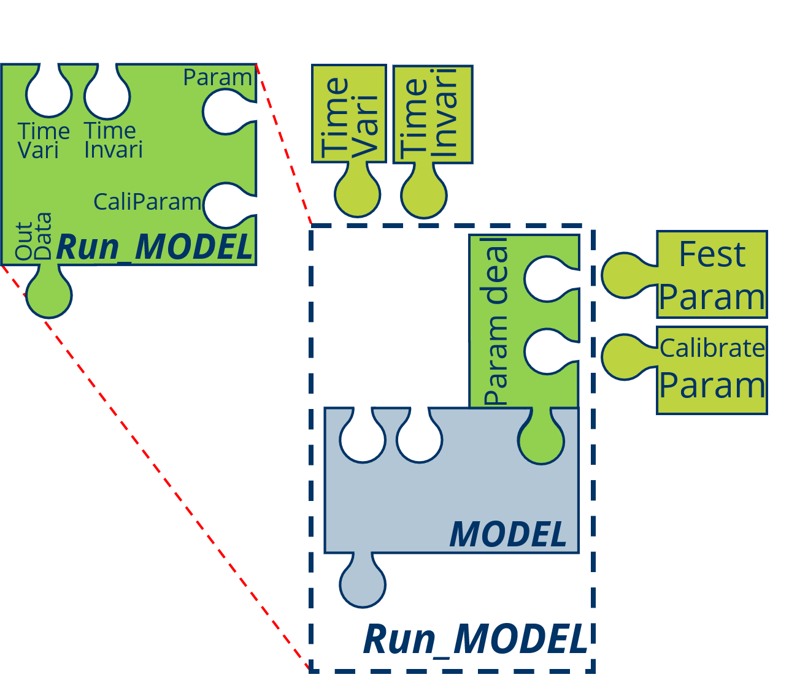
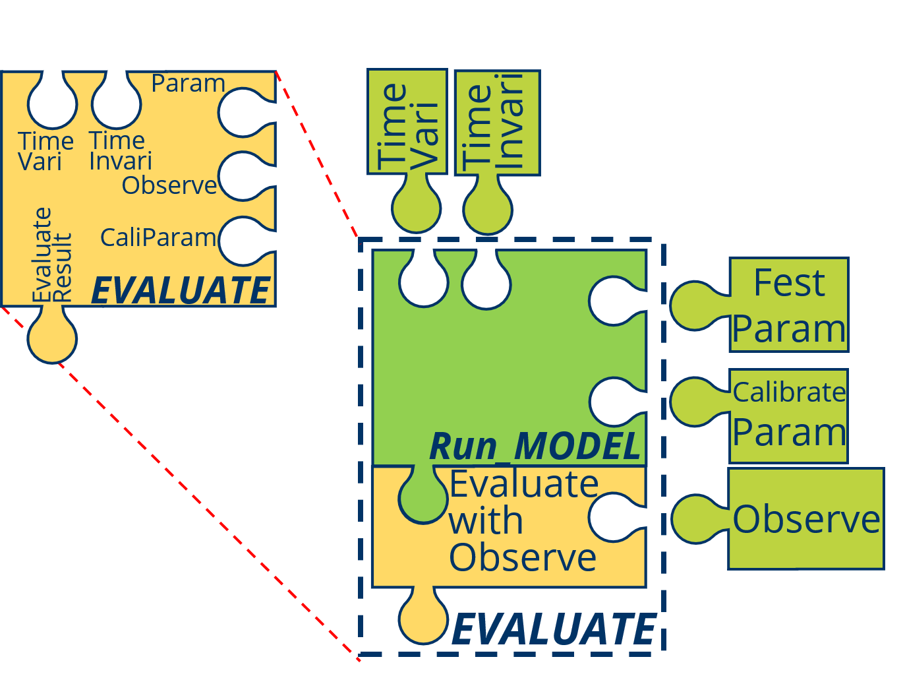
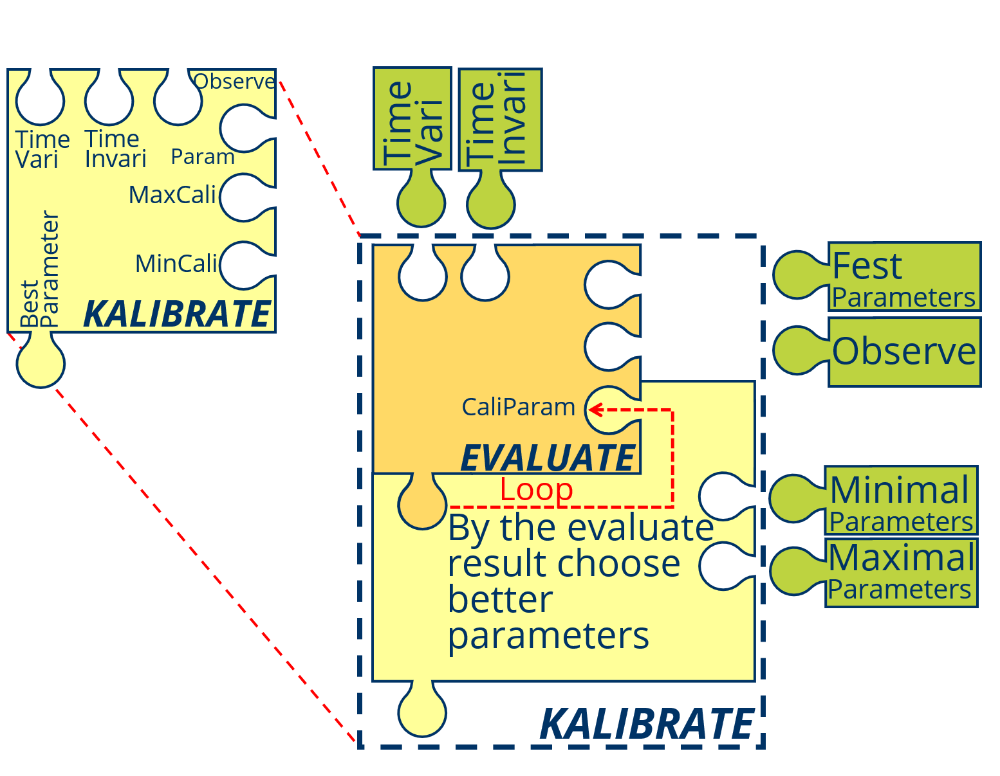

# Basic Concept {#base}

Before using of the EDHM it's very important to know the basic concept and primary idea about EDHM.

## Important ELements of EDHM



In EDHM the two mostly characters are **modularization** and **vectorization-arithmetic**, **modularization** focus on the coupling of the different *modules* of the hydrological *processes*, benefit by the modularization it's very convenience to change the method of process, what means the **editable** model; **vectorization-arithmetic** is very useful for the distributed hydrological model, it can greatly short the calculate time, especially when there are many grids (calculate units).

The water cycle of the Earth system and its variability at global, regional and local scales are influenced by a range of processes and mutual interactions, feedback mechanisms and as well as affected by anthropogenic processes.[@Rast.2014]

In EDHM a **PROCESS** is the mapping from those hydrological processes in a digital from, at the same time it's also the group (set) name of the some **MODULE**s those haven the same problem to solve and same aims, and a **MODULE** is the definite method of a **PROCESS**, it can also undersatnd as: 

**MODULE** = **PROCESS** $\times$ **Method**


For example [SNOW](#SNOW) is PROCESS mapping the process that snow melting, accumulate and the state variety, [SNOW.17](#SNOW.17) is then the true function that you can call in R, with the method by Andrson[@Anderson.1973] forward.

The PROCESS based on the hydrological processes, but sometimes a little different, due to the manual calculate factors in the lang time, some like *evapotranspiration* is a typical hydrological process, but in EDHM es is diveded into [ReferenceET](#ReferenceET) (reference evapotranspiration) and [ActualET](#ActualET) (actual evapotranspiration) two parts, because the most conceptual models calculate evapotranspiration in the two steps.

In the following section will show the meaning of hydrological processes and the mapped PROCESS.

**MODEL** is a coupled complete process with some subprocesses (also possible only one process), in EDHM is a true function to simulation the designed model with definite methods. It's also a set of **MODULE**s, those realize different process and correctly  by the physical process, it can also undersatnd as:

**MODEL** = $\sum$ **MODULE**$_i$



In addition to the PROCESS, MODULE, MODEL there are also some other concept oabout EDHM, some like: **function**, **Run_MODEL**, **EVALUTE** and **KALIBRATE**.

Essentially a MODULE or a MODEL is a function in R, so in R a function make up of **name**, **arguments** and **body**, except the output **return / value** is also very important. 

{width=50%}

The **name** of a MODULE composed of a PROCESS and Method, lik `ReferenceET.Hargreaves`; the **name** of a MODEL composed of "MODEL" and a model method, like `MODEL.CVIC`.

The **arguments** of MODULE and MODEL are fest in the form "InData, Param, ..." for MODULE and "TimeVariData, TimeInvariData, Param, ..." for MODEL, so for the data transfer it's very important to set the same structure as "Data_" dataset.

The **body** is the most important part of a function (MODULE or MODEL), generally it depended on the method.

The **OutData** (value) is also so important that not ignore, it must use the GROUP-VARIBLE type as InData. 

Excepted, the **reference** and a **data set**, that make up of InData, Param and OutData can't be omitted, especially when the MODULE or MODEL are also for the other aviable.

The arguments of a MODULE of include: **InData** and **Param**

The **VARIABLE** is the data those describe the state or character of the environment and the volume or character of water in different process. And in order to quickly find the VARIABLE and avoid the duplicate name of VARIABLE, the **GROUP** is like the folder of VARIABLE designed, for example in GROUP *Evatrans* (evapotranspiration) include the VARIABLEs *RET* (reference evapotranspiration), *AET* (actual evapotranspiration) and so on. 

In EDHM the **VARIABLE** saved as common type of for time-invariable VARIABLE, it depend on the MODEL or MODULE or "t_vari.array" that base on "array" type for time-variable VARIABLE. The first dimension must be the time-dimension. When it also has heterogeneity in horizontal spatial space, the second dimension slways is the space-dimension. In EDHM the spatial data are divided in to many **GRID**, in the using of MODEL the spatial contact between the GRIDs will ignored, all of GRIDs must have a ID (index) form 1 to number of GRIDs. But it's not important, how to divide the research region. For some VARIABLE there are also different layers, it can put in third demenision. 

**VARIABLE** are putted in the **GROUP**

{width=50%}

**InData** is a list of all VARIABLE the MODULE needed, like previous section explained the VARIABLEs must putted in the GROUP.


**Pram** is the parameter list of all the empirical parameters (different as function arguments) of the MODULE.

You can check the MODULE needed VARIABLE (InData) and parameters (Param) with "Data_" + MODULE name in R, some like `Data_ReferenceET.Linacre` and the same time every Param give the suggested maximal and minimal value of the parameter in this MODULE.

You can also check the same content in the R Help windows with the MODULE name.

The output of the MODELUE have the similar structure like InData, the VARIABLE of **OutData** is also include in the "**Data_**" dataset.

The **Data_XXX** is a list that had added in EDHM package, the using about it will show in the next chapter.

Different from MODULE the input variable of MODEL will divided in to **TimeVariData** and **TimeInvariData**:

**TimeVariData** is the dataset of all VARIBLE those are variable in the time serie, e.g. *TAir*, *Precipitation* and other meteorological data.

**TimeInvariData** is the dataset of all VARIBLE those are invariable in the time serie, e.g. *Latitude*, *Elevation* and other geological and topography data.

The aim to the division is in order to convenient get the data of one time step. Actuly the most MODULE can only deal with on time step data, because the state is associated to the last time step, in the MODULE there are no timely loop, only in MODEL there is a loop.

But for some MODULE, those not contact with last time (e.g. all MODULE in PROCESS [ReferenceET](#ReferenceET)) or the full time data are known (e.g. [ROUTE.G2RES](#ROUTE.G2RES)), you can calculate the whole time series without loop.

**Step** is special unit in EDHM, in EDHM the time serise is divided into many equal time interval, one time interval is a *Step*, the other units are given by [UCUM](https://ucum.org/trac). The most VAERIABLE like a rate, tempo those unit should be in [mm/Step], will simplify as [mm].

The using of a MODEL is the basic, but the Param (parameters) import base on the name-index not number-index, so it's essencially to make a **Run_MODELL** to transfer the parameters, especially when use auto calibration program. In a Run_MODELL function you can set the parameters those need to calibrate or not.



**EVALUTE** is a process by the application of hydrological model, use the mathematical form to evaluate the results of simulation, scilicet the . The sime time it is slso the basic for **CALIBRATE**, the most effective method for CALIBRATE is calculated into a number, like *NSE*, *KGE*. 



**CALIBRATE** is also a process by the application of hydrological model, in this process the parameters of the model are varied to minimize the difference between simulation result and observed data.




## Basic Concept of Hydrological Cycle


The hydrological cycle is composed of different components, which include evaporation from water surfaces and bare soil, evapotranspiration from vegetated land, transport of water vapour in the atmosphere, cloud droplet formation and cloud dynamics, the mechanisms leading to liquid and solid precipitation, the movement of water and change in soil moisture in the unsaturated soil, including root dynamics, surface and river run-off, and groundwater flow.[@Rast.2014]

Also from [@LANGBEIN.1960]: A convenient term to denote the circulation of water from the sea, through the atmos- phere, to the land; and thence, with many delays, back to the sea by overland and subterranean routes, and in part by way of the atmosphere; also the many short circuits of the water that is re- turned to the atmosphere without reaching the see.

The whole cycle will spilt by the vertical layer in six layers which are [Atmosphe](#Atmosphe1), [Snow](#Snow1), [Canopy](#Canopy1), [Surface](#Surface), [Subsurface](#Subsurface1) and [Ground](#Ground1). There indeed are not the complete hydrological cycle components, limited by the first stage, in the first stage will focus on the conceptual models.


### Atmosphere (Atmos) {#Atmosphe1}

In the Atmosphere major occur the process precipitation and part of the evapotranspiration, the concept of the evapotranspiration will show in section \@ref(Canopy1) in Canopy group.

***Precipitation:*** As used in hydrology, precipitation is the discharge of water, in liquid or solid state, out of the atmosphere, generally upon a land or water surface. It is the common process by which atmospheric water becomes surface or subsurface water * * *. The term "precipitation" is also commonly used to designate the quantity of water that is precipitated. (Meinzer, 1923, p. 15.) Precipitation includes rainfall, snow, hail, and sleet, and is therefore a more general terr than rainfall.

***Effective precipitation:*** 1. That part of the precipitation that produces runoff. 2. A weighted average of current and antecedent precipitation that is "effective" in correlating with runoff.[@LANGBEIN.1960]

The two most important forms of precipitation are rainfall and snowfall, the other form will not considered in general situation or simulation. 

***Rainfall:*** The quantity of water that falls as rain only. Not synonymous with precipitation.

***Snowfall:*** A form of precipitation composed of ice crystals.

In this layer PROCESS [PRECDicid](#SNOW) and GROUP ***Prec*** show in the following Table:

```{r t_G_Prec, echo = FALSE}
Gr_name <- 'Prec'
Variable_Name <- names(Pre_dataset[[Gr_name]])
Unit_ <- as.character(map(Variable_Name, function(b) Unit_dataset[[Gr_name]][[b]]))
Des_ <- as.character(map(Variable_Name, function(b) Des_dataset[[Gr_name]][[b]]))
df_Group <- data.frame(Variable = Variable_Name, Unit = Unit_, Description = Des_)
kable(df_Group, row.names = F) %>% collapse_rows(1) %>% kable_styling(latex_options = "hold_position")
```

And the typical meteorological data set ***MetData*** 

```{r t_G_MetData, echo = FALSE}
Gr_name <- 'MetData'
Variable_Name <- names(Pre_dataset[[Gr_name]])
Unit_ <- as.character(map(Variable_Name, function(b) Unit_dataset[[Gr_name]][[b]]))
Des_ <- as.character(map(Variable_Name, function(b) Des_dataset[[Gr_name]][[b]]))
df_Group <- data.frame(Variable = Variable_Name, Unit = Unit_, Description = Des_)
kable(df_Group, row.names = F) %>% collapse_rows(1) %>% kable_styling(latex_options = "hold_position")
```


### Snow {#Snow1}

***waterequivalent of snow:*** Amount of water that would be obtained if the snow should be completely melted. Water content may be merely the amount of liquid water in the snow at the time of observation. (Wilson, 1942a, p. 153-154.)

In this layer PROCESS [SNOW](#SNOW) and GROUP ***Snow*** show in the following Table:


```{r t_G_Snow, echo = FALSE}
Gr_name <- 'Snow'
Variable_Name <- names(Pre_dataset[[Gr_name]])
Unit_ <- as.character(map(Variable_Name, function(b) Unit_dataset[[Gr_name]][[b]]))
Des_ <- as.character(map(Variable_Name, function(b) Des_dataset[[Gr_name]][[b]]))
df_Group <- data.frame(Variable = Variable_Name, Unit = Unit_, Description = Des_)
kable(df_Group, row.names = F) %>% collapse_rows(1) %>% kable_styling(latex_options = "hold_position")
```

### Canopy {#Canopy1}

***Condensation:*** The process by which water changes from the vapor state into the liquid or solid state. It is the reverse of evaporation.[@LANGBEIN.1960]

***Evaporation:***The process by which water is changed from the liquid or the solid state into the vapor state. In hydrology, evaporation is vaporization that takes place at a temperature below the boiling point.[@LANGBEIN.1960]

***Transpritation:*** The quantity of water absorbed and transpired and used directly in the bulling of plant tissue, in a specified time. It does not include soil evaporation. (After Blaney, I951a, p. 4.) The process by which water vapor escapes from the living plant, principally the leaves, and enters the atmosphere. As considered practically, transpiration also includes *guttation*. (Lee, 1949, p. 260.)

***Evapotranspiration:*** Water withdrawn from a land area by evaporation from water surfaces and moist, soil and plant transpiration.[@LANGBEIN.1960]

***Relative evaporation:*** The ratio of the rate of evaporation from a land or water surface in contact with the atmosphere, to the evaporativity under existing atmospheric conditions. It is the ratio of actual to potential rate of evaporation, generally stated as a percentage. (Derived from Meinzer, 1923, p. 14.) The opportunity for a given rate of evaporation to continue is determined by the available moisture supply. (Meyer, 1928, p. 244.)

***Potential evaporation:*** Water loss that will occur if at no time there is a deficiency of water in the soil for use of vegetation. (Thornthwaite, 1944, p. 687.)

***Interception:*** The process and the amount of rain or snow stored on leaves and branches and eventually evaporated back to the air. Interception equals the precipitation on the vegetation minus stem flow and throughfall (after Hoover, 1953, p. 1.)

In this layer PROCESS [ReferenceET](#ReferenceET), [ActualET](#ActualET), [INTERCEPTION](#INTERCEPTION) and GROUP ***Evatrans*** show in the following table:

```{r t_G_Evatrans, echo = FALSE}
Gr_name <- 'Evatrans'
Variable_Name <- names(Pre_dataset[[Gr_name]])
Unit_ <- as.character(map(Variable_Name, function(b) Unit_dataset[[Gr_name]][[b]]))
Des_ <- as.character(map(Variable_Name, function(b) Des_dataset[[Gr_name]][[b]]))
df_Group <- data.frame(Variable = Variable_Name, Unit = Unit_, Description = Des_)
kable(df_Group, row.names = F) %>% collapse_rows(1) %>% kable_styling(latex_options = "hold_position")
```

***Intercept*** show in the following table:

```{r t_G_Intercept, echo = FALSE}
Gr_name <- 'Intercept'
Variable_Name <- names(Pre_dataset[[Gr_name]])
Unit_ <- as.character(map(Variable_Name, function(b) Unit_dataset[[Gr_name]][[b]]))
Des_ <- as.character(map(Variable_Name, function(b) Des_dataset[[Gr_name]][[b]]))
df_Group <- data.frame(Variable = Variable_Name, Unit = Unit_, Description = Des_)
kable(df_Group, row.names = F) %>% collapse_rows(1) %>% kable_styling(latex_options = "hold_position")
```

***Canopy*** show in the following table:

```{r t_G_Canopy, echo = FALSE}
Gr_name <- 'Canopy'
Variable_Name <- names(Pre_dataset[[Gr_name]])
Unit_ <- as.character(map(Variable_Name, function(b) Unit_dataset[[Gr_name]][[b]]))
Des_ <- as.character(map(Variable_Name, function(b) Des_dataset[[Gr_name]][[b]]))
df_Group <- data.frame(Variable = Variable_Name, Unit = Unit_, Description = Des_)
kable(df_Group, row.names = F) %>% collapse_rows(1) %>% kable_styling(latex_options = "hold_position")
```

And ***Aerodyna*** show in the following table:

```{r t_G_Aerodyna, echo = FALSE}
Gr_name <- 'Aerodyna'
Variable_Name <- names(Pre_dataset[[Gr_name]])
Unit_ <- as.character(map(Variable_Name, function(b) Unit_dataset[[Gr_name]][[b]]))
Des_ <- as.character(map(Variable_Name, function(b) Des_dataset[[Gr_name]][[b]]))
df_Group <- data.frame(Variable = Variable_Name, Unit = Unit_, Description = Des_)
kable(df_Group, row.names = F) %>% collapse_rows(1) %>% kable_styling(latex_options = "hold_position")
```

### Surface (Runoff, Route) {#Surface1}

***Runoff:*** That part of the precipitation that appears in surface streams. It is the same as streamflow unaffected by artificial diversions, storage, or other works of man in or on the stream channels. Runoff may be classified as follows: Classification as to speed of appearance after rain- fall or snow melting: Direct runoff Base runoff Classification as to source: Surface runoff Storm seepage Groundwater runoff.

***Surface runoff:*** That part of the runoff which travels over the soil surface to the nearest stream channel. It is also defined as that part of the runoff of a drainage basin that has not passed beneath the surface since precipitation. The term is misused when applied in the sense of direct runoff. See also, Runoff, Overland flow, Direct runoff, Groundwater runoff, and Surface water.

***Direct runoff:*** The runoff entering stream channels promptly after rainfall or snowmelt. Superposed on base runoff, it forms the folk of the hydrograph of a flood. See also surface runoff. The terms base runoff and direct runoff are time classifications of runoff. The terms ground-water runoff and surface runoff are classifications according to source.[@LANGBEIN.1960]

***Infiltration capacity:*** The maximum rate at which the soil, when in a given condition, can absorb falling rain or melting snow.[@Horton.1933]

***Infiltration:*** The flow of a fluid into a substance through pores or small openings. It connotes flow into a substance in cont distinction to the word percolation, which connotes flow through a porous sub- stance.[@Horton.1941]

***Overland flow:*** The flow of rainwater or snowmelt over the land surface toward stream channels. After it enters a stream, it becomes runoff.[@LANGBEIN.1960]

***Streamflow:*** The discharge that occurs in a natural channel. Although the term discharge can be applied to the flow of a canal, the word streamflow uniquely describes the discharge in a surface stream course. The term "streamflow" is more general than runoff, as streamflow may be applied to dis- charge whether or not it is affected by diversion or regulation.[@LANGBEIN.1960]

***Unit hydrograph*** The hydrograph of direct runoff from a storm uni- formly distributed ever the drain- age basin during a specified unit of time; the hydrograph is reduced in vertical scale to correspond to a volume of runoff o* 1 inch from the drainage basin. (After Am. Soc. Civil Engineers 1949, p. 105.)

In this layer PROCESS [RUNOFF](#RUNOFF), [ROUTE](#ROUTE) and GROUP ***Route*** show in the following table:

```{r t_G_Route, echo = FALSE}
Gr_name <- 'Route'
Variable_Name <- names(Pre_dataset[[Gr_name]])
Unit_ <- as.character(map(Variable_Name, function(b) Unit_dataset[[Gr_name]][[b]]))
Des_ <- as.character(map(Variable_Name, function(b) Des_dataset[[Gr_name]][[b]]))
df_Group <- data.frame(Variable = Variable_Name, Unit = Unit_, Description = Des_)
kable(df_Group, row.names = F) %>% collapse_rows(1) %>% kable_styling(latex_options = "hold_position")
```

And ***GeoData*** show in the following table:

```{r t_G_GeoData, echo = FALSE}
Gr_name <- 'GeoData'
Variable_Name <- names(Pre_dataset[[Gr_name]])
Unit_ <- as.character(map(Variable_Name, function(b) Unit_dataset[[Gr_name]][[b]]))
Des_ <- as.character(map(Variable_Name, function(b) Des_dataset[[Gr_name]][[b]]))
df_Group <- data.frame(Variable = Variable_Name, Unit = Unit_, Description = Des_)
kable(df_Group, row.names = F) %>% collapse_rows(1) %>% kable_styling(latex_options = "hold_position")
```


### Subsurface (Subsur) {#Subsurface1}

***Field-moisture capacity:*** The quantity of water which can be permarently retained in the soil in opposition to the downward pull of gnvity.[@Horton.1933]

***Field-moisture deficiency:*** The quantity of water, which would be required to restore the soil moisture to field-moisture capacity.[@Horton.1933]

***Field-moisture:*** Water diffused in the soil, the upper part of the zone of aeration from which water is discharged by the trans- piration of plants or by soil evap- oration. See Field-moisture ca- pacity and Field-moisture defi- ciency.

In this layer PROCESS [InfiltratRat](#InfiltratRat), [Infiltration](#Infiltration) and GROUP ***Infilt*** show in the following table:

```{r t_G_Infilt, echo = FALSE}
Gr_name <- 'Infilt'
Variable_Name <- names(Pre_dataset[[Gr_name]])
Unit_ <- as.character(map(Variable_Name, function(b) Unit_dataset[[Gr_name]][[b]]))
Des_ <- as.character(map(Variable_Name, function(b) Des_dataset[[Gr_name]][[b]]))
df_Group <- data.frame(Variable = Variable_Name, Unit = Unit_, Description = Des_)
kable(df_Group, row.names = F) %>% collapse_rows(1) %>% kable_styling(latex_options = "hold_position")
```

And ***SoilData*** show in the following table:

```{r t_G_SoilData, echo = FALSE}
Gr_name <- 'SoilData'
Variable_Name <- names(Pre_dataset[[Gr_name]])
Unit_ <- as.character(map(Variable_Name, function(b) Unit_dataset[[Gr_name]][[b]]))
Des_ <- as.character(map(Variable_Name, function(b) Des_dataset[[Gr_name]][[b]]))
df_Group <- data.frame(Variable = Variable_Name, Unit = Unit_, Description = Des_)
kable(df_Group, row.names = F) %>% collapse_rows(1) %>% kable_styling(latex_options = "hold_position")
```

### Ground {#Ground1}

***Base flow / runoff:*** Sustained or fair weather runoff. In most streams, base base flow is composed largely of ground water effluent. (Langbein and others, 1947, p. 6.) The term base flow is often used in the same sense as base runoff. However, the distinction is the same as that between stream flow and runoff. When the concept in the terms base flow and base runoff is that of the natural flow in a stream, base runoff is the logical term.

***Groundwater:*** Water in the ground that is in the zone of saturation, from which wells, springs, and ground-water runoff are supplied. (After Meinzer, 1949, p. 38r,)

In this layer PROCESS [GROUNDWATER](#GROUNDWATER) and GROUP ***Ground*** show in the following table:

```{r t_G_Ground, echo = FALSE}
Gr_name <- 'Ground'
Variable_Name <- names(Pre_dataset[[Gr_name]])
Unit_ <- as.character(map(Variable_Name, function(b) Unit_dataset[[Gr_name]][[b]]))
Des_ <- as.character(map(Variable_Name, function(b) Des_dataset[[Gr_name]][[b]]))
df_Group <- data.frame(Variable = Variable_Name, Unit = Unit_, Description = Des_)
kable(df_Group, row.names = F) %>% collapse_rows(1) %>% kable_styling(latex_options = "hold_position")
```

Except the above data GROUP, the ***TimeData*** describe the time information:

```{r t_G_TimeData, echo = FALSE}
Gr_name <- 'TimeData'
Variable_Name <- names(Pre_dataset[[Gr_name]])
Unit_ <- as.character(map(Variable_Name, function(b) Unit_dataset[[Gr_name]][[b]]))
Des_ <- as.character(map(Variable_Name, function(b) Des_dataset[[Gr_name]][[b]]))
df_Group <- data.frame(Variable = Variable_Name, Unit = Unit_, Description = Des_)
kable(df_Group, row.names = F) %>% collapse_rows(1) %>% kable_styling(latex_options = "hold_position")
```


