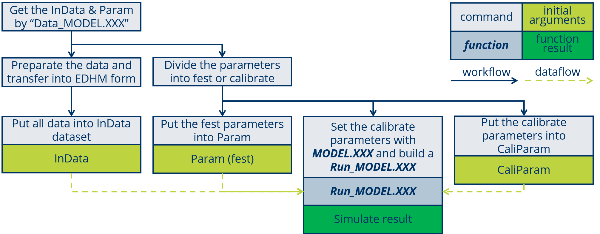
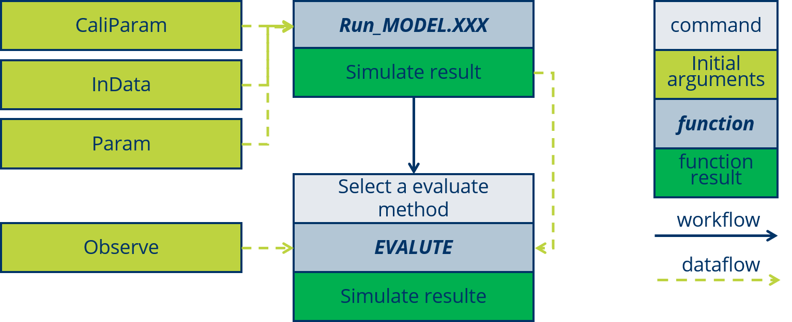
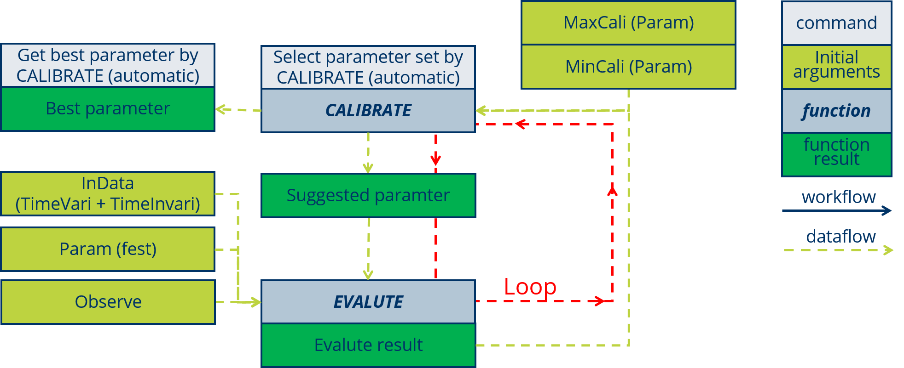

# Model Use and Develop {#develop}


## Basic Use of a complete MODELL

### RUn a MODEL

The using of a MODEL will summarized as four step:


1. Get the InData & Param list by run `Data_MODEL.XXX` in R, the list of "Data_" is structured as:


2. Prepare the data and transfer into EDHM form and confirm a parameter set. 

Please must mark the time-variable and time-invariable VARIABLEs.

Please use `Data_XXX$InData$GROUP$VARIABLE` check the VARIABLE structure, when the VARIABLE is not normal.

3. Input the prepared data to InData and Param. 

For the time-variable VARIBLE must put into "TimeVari", some like "VARIABLE 1, 2" belong to "GROUP 1" and time-variable, "VARIABLE 3" belong to also "GROUP 1" but time-invariable. Then they will be structured as:


The code for this exemple like:
```{}
TimeVari <- t_vari.hm.list()
TimeVari$GROUP1$VARIABLE1 <- mydata1
TimeVari$GROUP1$VARIABLE2 <- mydata2
TimeVari$GROUP2$VARIABLE4 <- mydata3

TimeInVari <- hm.list()
TimeInVari$GROUP1$VARIABLE3 <- mydata4

Param <- list()
Param$Paramter1 <- myparam1
Param$Paramter2 <- myparam2
```

4. Run the MODEL.
```{}
my_simu <- MODELL.XXX(TimeVari, TimeInVari, Param)
```


### set a Run_MODEL



There shows the function `Run_MODEL.SERR`:

```{r}
Run_Model.SERR <- function(TimeVariData, TimeInvariData, Param,
                           ParamterCalibrate){
  ## 1.0 snow##
  Param$Max_Snow_T = ParamterCalibrate[1]
  Param$Min_Snow_T = ParamterCalibrate[2]
  Param$Factor_Day_degree = ParamterCalibrate[3]  ## 2.7-12 [mm]
  Param$Base_T = ParamterCalibrate[4]  ## -2-5.5 [Cel]
  ## 1.1 ET ##
  Param$CanopyCapacity = ParamterCalibrate[5]
  Param$Coeff_ET_Capacity_Attenuat = ParamterCalibrate[6]
  ## 1.2 Runoff ##
  Param$Threshold_Runoff = ParamterCalibrate[7]
  Param$Ratio_Runoff = ParamterCalibrate[8]
  Param$Ratio_GW_Storage = ParamterCalibrate[9]
  Param$Coeff_GW_Storage_Attenuat = ParamterCalibrate[10]
  ## 1.3 Route ##
  Param$UPPaList = ParamterCalibrate[11:17]

  Result_ <- MODEL.SERR(TimeVariData, TimeInvariData, Param)
  Result <- Result_$Route$StaFlow
  return(Result)
}
```

The workflow is show in the following figure:


### Evaluate



### Calibrate



### Check the InData list

### Data Preparation

## Copuling a new Model with MODULE

### Choose MODULE

### Set the Data-FLow

### Build the MODEL and Run_MODEL

## Design a new MODULE

### Method and Formula

### Coding the Inhalt

### Set In/OutData and Parameter


