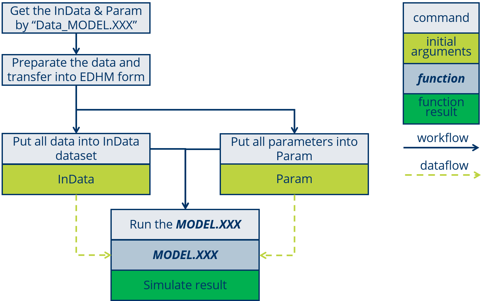
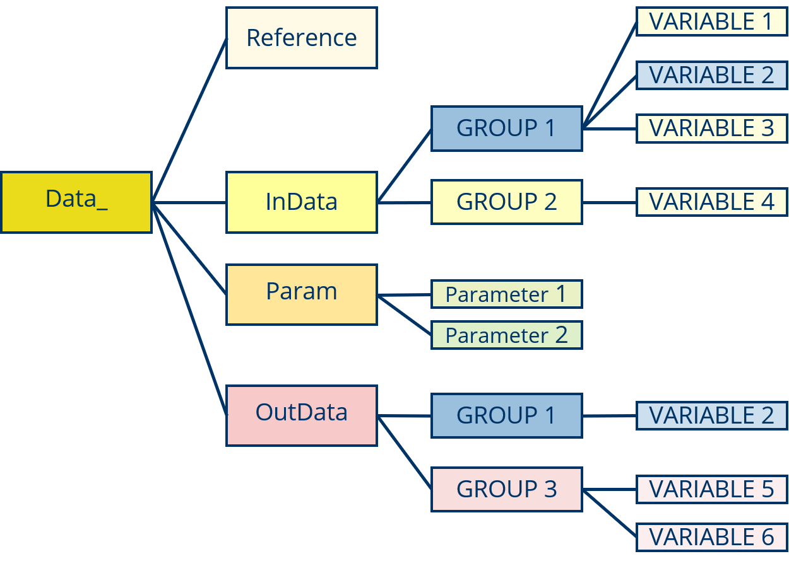
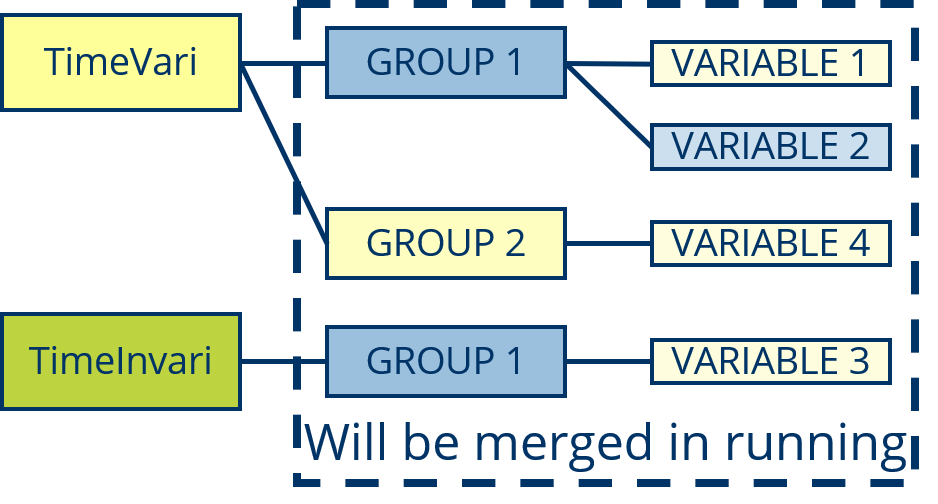
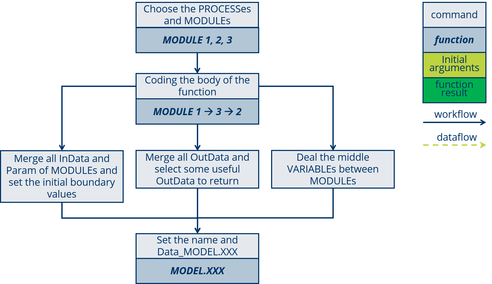
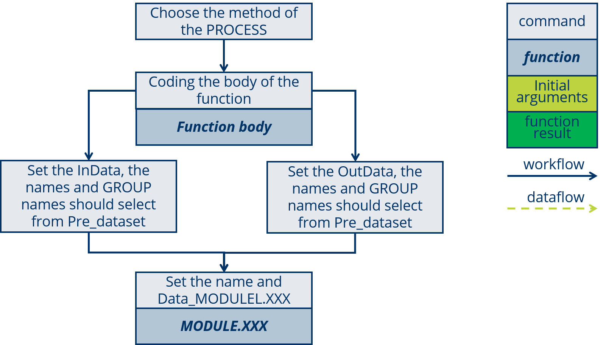

# Model Use and Develop {#develop}


## Basic Use of a complete MODELL

### RUn a MODEL

The using of a MODEL will summarized as four steps:



1. Get the InData & Param list by run `Data_MODEL.XXX` in R, the list of "Data_" is structured as:




2. Prepare the data and transfer into EDHM form and confirm a parameter set. 

Please must mark the time-variable and time-invariable VARIABLEs.

Please use `Data_XXX$InData$GROUP$VARIABLE` check the VARIABLE structure, when the VARIABLE is not normal.

3. Input the prepared data to InData and Param. 

For the time-variable VARIBLE must put into "TimeVari", some like "VARIABLE 1, 2" belong to "GROUP 1" and time-variable, "VARIABLE 3" belong to also "GROUP 1" but time-invariable. Then they will be structured as:



The code for this exemple like:
```{}
TimeVari <- t_vari.hm.list()
TimeVari$GROUP1$VARIABLE1 <- mydata1
TimeVari$GROUP1$VARIABLE2 <- mydata2
TimeVari$GROUP2$VARIABLE4 <- mydata3

TimeInVari <- hm.list()
TimeInVari$GROUP1$VARIABLE3 <- mydata4

Param <- list()
Param$Paramter1 <- myparam1
Param$Paramter2 <- myparam2
```

4. Run the MODEL.
```{}
my_simu <- MODELL.XXX(TimeVari, TimeInVari, Param)
```


### set a Run_MODEL

In EDHM the parameters are index with the parameters name, but when we calibrate the parameters, we set the parameters in a vector, also for some research not all of the parameters need to calibrate, so there is a setting about parameters from vector transfer to list.

There shows the function `Run_MODEL.SERR`:

```{r}
Run_Model.SERR <- function(TimeVariData, TimeInvariData, Param,
                           ParamterCalibrate){
  ## 1.0 snow##
  Param$Max_Snow_T = ParamterCalibrate[1]
  Param$Min_Snow_T = ParamterCalibrate[2]
  Param$Factor_Day_degree = ParamterCalibrate[3]  ## 2.7-12 [mm]
  Param$Base_T = ParamterCalibrate[4]  ## -2-5.5 [Cel]
  ## 1.1 ET ##
  Param$CanopyCapacity = ParamterCalibrate[5]
  Param$Coeff_ET_Capacity_Attenuat = ParamterCalibrate[6]
  ## 1.2 Runoff ##
  Param$Threshold_Runoff = ParamterCalibrate[7]
  Param$Ratio_Runoff = ParamterCalibrate[8]
  Param$Ratio_GW_Storage = ParamterCalibrate[9]
  Param$Coeff_GW_Storage_Attenuat = ParamterCalibrate[10]
  ## 1.3 Route ##
  Param$UPPaList = ParamterCalibrate[11:17]

  Result_ <- MODEL.SERR(TimeVariData, TimeInvariData, Param)
  Result <- Result_$Route$StaFlow
  return(Result)
}
```

The workflow is show in the following figure:


### Evaluate

Usually bye EVALUTE evalute the simulation results, but when we kalibrate the parameters, the EVALUTE evalute actully the parameters, those need to calibrate, so the EVALUTE based on the Run_MODEL.

The data flow is show in the following figure:


The EVALUTE functions is very easy to code, and the R Package ***hydroGOF*** [@R-hydroGOF] is also recommend, in that there are some commen evalute methods for hydrological field, some like *NSE*, *KGE*, *mae* and soon.

`EVALUTE()` is a function in EDHM, by setting `EVALUTE(..., fct_Evaluate = NSE)` set the evaluate method. The argument `fct_Evaluate` require a function, so give it just the function name without the quotation marks into a charater.

### Calibrate

The CALIBRATE help us choose the best parameter-set from a range, CALIBRATE will by the goodness of evaluate results and some algorithms to choose the parameters, at the end of algorithms find the best parameters-set, the "it" thinks.

The data flow is show in the following figure:


The R package ***mcga*** [@R-mcga] is recommend to calibrate, it is a Machine coded genetic algorithm to calibrate multi-parameters problem.

`mcga2()` is the main function, this function require at least three arguments: `fitness` a function that can return a value to evaluate the parameters-set, `min` minimal parameters-set in vector, `max` maximal parameters-set in vector, and other arguments those `fitness` require. The `fitness` in EDHM is just the function `EVALUTE()`.

For example:

```{}
Fitness_GA = mcga2(fitness  = EVALUATE,
                   fct_Run_Model = Run_Model.SERR,
                   TimeVariData = TimeVariData_run,
                   TimeInvariData = TimeInvariData,
                   Paramter_fest = Param_Base,
                   Observe = Observe_run,
                   warmUPN = 500,
                   fct_Evaluate = KGE,
                   min = ParamterCalibrateMin,
                   max = ParamterCalibrateMax,
                   popSize = 15,
                   maxiter = 18)
```


### Check the InData list

After the preparation of data must check the data, weather there is NA or other unlogical data.

The check tools will provide in the fast future.

## Coupling a new Model with MODULE


Generally researcher design a model for a basin or some specific environment, so in a new research region, we can use one model, the designed for this kind of basin or watershed and calibrate the empirical parameters. But sometimes by the calibrate of parameters can also not solve the problem, so researcher need change some of process to promote the simulation. In EDHM researcher are can use many MODULEs to build a new MODEL. The available PROCESSes and MODELs is show in the [table](#module).

The coupling of a new MODEL will summarized as six steps:



---

In this section a example `MODEL.GR4J` will show for explain.

---

### Choose MODULE

After the new designed model, there will required some PROCESSes, check the PROCESS and MODULE [table](#module) and choose the relevant Methods to those PROCESS, also say the MODULEs. In this table you can click the MODULE name check the InData, Param and OutData in order to better understand the MODULE, also the literature of this Method is accessible.

---

The MODULEs `ReferenceET.Hargreaves`, `ActualET.Gr4j`, `	RUNOFF.Gr4j` and `ROUTE.Gr4j` are selected.

---

### Set the Order

Every PROCESS (MODULE) have the clear physical meaning, so by those you should set a correct order of those MODULEs.

---

The PROCESS `ReferenceET` is certainly before `ActualET`, and `ROUTE` is the end PROCESS of a rainfall-runoff model. So the MODULE will set as:

```{}
## ET
ETOut <- ActualET.Gr4j(InData, Param) # S2
## Runoff
RFOut <- RUNOFF.Gr4j(InData, Param) # S2
## Route
RTOut <- ROUTE.Gr4j(InData, Param) # S2
```

---

### Deal with InData and Param

"**Data Space**" and "**Parameter List**" are the data-flow of the MODEL, the "Data Space" will save all of the VARIABLEs, it can be readied by the MODULE and use the function `left_merge()` write the OutData of MODULE into it.

In the running of MODEL the InData will set into StepData for every step.


The step will divided into five sub-steps:

0. Get the parameters from Param; [# S3-0]

1. Initialize the StepData; [# S3-1]

2. Set the initial boundary data; [# S3-2]

3. Make loop for every step; [# S3-3]

4. Merge the OutData into "Data Space" (StepData). [# S3-4]


---

```{}
  PeriodN <- Param$PeriodN # S3-0
  GridN <- Param$GridN # S3-0
  ## StepData
  StepData <- new('hm.list') # S3-1
  StepData$Ground$MoistureVolume <- rep(0, GridN) # S3-2
  StepData <- left_merge(StepData, TimeInvariData) # S3-2

  for(i in 1: PeriodN){ # S3-3
    Param$time_step_i <- i
    StepData <- left_merge(StepData, TimeVariData[i]) # S3-4
    ## ET
    ETOut <- ActualET.Gr4j(StepData, Param) # S2
    StepData <- left_merge(StepData, ETOut) # S3-4
    ## Runoff
    RFOut <- RUNOFF.Gr4j(StepData, Param) # S2
    StepData <- left_merge(StepData, RFOut)
    StepData$Route$WaterSource <- StepData$Groud$Runoff * StepData$GridData$Area / Param$TimeStepSec / 1000
    ## Route
    RTOut <- ROUTE.Gr4j(StepData, Param) # S2
    StepData <- left_merge(StepData, RTOut) # S3-4
  }
```

---

### Set OutData

In EDHM which VARIABLE need to output are enable to choose, those are useful for research.

The step will divided into two sub-steps:

1. Initialize the OutData; [# S4-1]

2. Transfer from StepData into OutData. [# S4-2]

---

```{}
  PeriodN <- Param$PeriodN # S3-0
  GridN <- Param$GridN # S3-0
  ## StepData
  StepData <- new('hm.list') # S3-1
  StepData$Ground$MoistureVolume <- rep(0, GridN) # S3-2
  StepData <- left_merge(StepData, TimeInvariData) # S3-2
  ## OutData
  OutData <- new("t_vari.hm.list") # S4-1
  OutData$Route$StaFlow <- t_vari.array(0, c(PeriodN, GridN)) # S4-1
  
  for(i in 1: PeriodN){ # S3-3
    Param$time_step_i <- i
    StepData <- left_merge(StepData, TimeVariData[i]) # S3-4
    ## ET
    ETOut <- ActualET.Gr4j(StepData, Param) # S2
    StepData <- left_merge(StepData, ETOut) # S3-4
    ## Runoff
    RFOut <- RUNOFF.Gr4j(StepData, Param) # S2
    StepData <- left_merge(StepData, RFOut)
    StepData$Route$WaterSource <- StepData$Groud$Runoff * StepData$GridData$Area / Param$TimeStepSec / 1000
    ## Route
    RTOut <- ROUTE.Gr4j(StepData, Param) # S2
    StepData <- left_merge(StepData, RTOut) # S3-4
    OutData[i] <- StepData # S4-2
  }
```

---

### Deal with middle VARIABLE

The InData of MODULE naming by the regulation, that can clear many works, but there still are some VARIABLE those need to deal.

---

In this Example, the `Ground$Runoff` is in [mm] calculated but `Route$WaterSource` require a unit [m3/s], so people must transfer the two VARIABLEs.

```{}
    ## Runoff
    RFOut <- RUNOFF.Gr4j(StepData, Param) # S2
    StepData <- left_merge(StepData, RFOut)
    StepData$Route$WaterSource <- StepData$Groud$Runoff * StepData$GridData$Area / Param$TimeStepSec / 1000 # S5
    ## Route
    RTOut <- ROUTE.Gr4j(StepData, Param) # S2
    StepData <- left_merge(StepData, RTOut) # S3-4
```

---

### Name and Data_

At the end only require a name for this MODEL, most importantly please not forget make the **Data_** dataset.

---

```{r model_gr4j, cache=FALSE}
MODEL.GR4J <- function(TimeVariData, TimeInvariData, Param, ...) {
  PeriodN <- Param$PeriodN # S3-0
  GridN <- Param$GridN # S3-0
  ## StepData
  StepData <- new('hm.list') # S3-1
  StepData$Ground$MoistureVolume <- rep(0, GridN) # S3-2
  StepData <- left_merge(StepData, TimeInvariData) # S3-2
  ## OutData
  OutData <- new("t_vari.hm.list") # S4-1
  OutData$Route$StaFlow <- t_vari.array(0, c(PeriodN, GridN)) # S4-1
  
  for(i in 1: PeriodN){ # S3-3
    Param$time_step_i <- i
    StepData <- left_merge(StepData, TimeVariData[i]) # S3-4
    ## ET
    ETOut <- ActualET.Gr4j(StepData, Param) # S2
    StepData <- left_merge(StepData, ETOut) # S3-4
    ## Runoff
    RFOut <- RUNOFF.Gr4j(StepData, Param) # S2
    StepData <- left_merge(StepData, RFOut)
    StepData$Route$WaterSource <- StepData$Groud$Runoff * StepData$GridData$Area / Param$TimeStepSec / 1000 # S5
    ## Route
    RTOut <- ROUTE.Gr4j(StepData, Param) # S2
    StepData <- left_merge(StepData, RTOut) # S3-4
    OutData[i] <- StepData # S4-2
  }
  
  return(OutData)
}
```

---


## Design a new MODULE


Not only the coupling of MODULEs but also design a new MODULE very easy with EDHM. And one point need to mark that the MODULE should support the **vectorization-arithmetic**.

The workflow show in following figure:


The design of a new MODULE will summarized as five steps:

---

In this section will show the example `ActualET.Gr4j`.

---

### Method and Formula

The method and formulas for a PROCESS can collected from all kinds of books and literature.

---

The calculate method of GR4J shows in the [link](https://webgr.inrae.fr/en/models/daily-hydrological-model-gr4j/description-of-the-gr4j-model/).

---

### Coding the body

By the formulas can program the function body easily.

---

```{}
  judge_PbE <- P > E # S1
  Pn <- judge_PbE * (P - E) # S1
  En <- (!judge_PbE) * (E - P) # S1
  Es <- S * (2 - S / X1) * tanh(En / X1) / (1 + (1 - S / X1) * tanh(En / X1)) # S1
```

---

### Set In/OutData and Parameter

The most important of the design is the naming of InData and OutData, all of them should select from `Pre_dataset`, include the GROUP name and VARIABLE name, when the VARIABLE is only used for this MODULE, the naming is not rigid.

---

```{}
  X1 <- Param$Gr4j_X1 # S2-1
  E <- InData$Evatrans$RET # S2-1
  S <- InData$Ground$MoistureVolume # S2-1
  P <- InData$Prec$Precipitation # S2-1
  judge_PbE <- P > E # S1
  Pn <- judge_PbE * (P - E) # S1
  En <- (!judge_PbE) * (E - P) # S1
  Es <- S * (2 - S / X1) * tanh(En / X1) / (1 + (1 - S / X1) * tanh(En / X1)) # S1
  return(list(Evatrans = list(AET = Es), Prec = list(Precipitation = Pn))) # S2-2
```

---

### Name and Data_

The name of a MODULE should base on the PROCESS name and add the mark of this method.

---

In the example the PROCESS is "ActualET", and the method can mark as "Gr4j", so get the MODLUE name "ActualET.Gr4j"

```{r}
ActualET.Gr4j <- function(InData, Param, ...){ # S3
  X1 <- Param$Gr4j_X1 # S2-1
  E <- InData$Evatrans$RET # S2-1
  S <- InData$Ground$MoistureVolume # S2-1
  P <- InData$Prec$Precipitation # S2-1
  judge_PbE <- P > E # S1
  Pn <- judge_PbE * (P - E) # S1
  En <- (!judge_PbE) * (E - P) # S1
  Es <- S * (2 - S / X1) * tanh(En / X1) / (1 + (1 - S / X1) * tanh(En / X1)) # S1
  return(list(Evatrans = list(AET = Es), Prec = list(Precipitation = Pn))) # S2-2
}

```

---

---

The Data_ActualET.Gr4j can be write as:

```{r}
Data_ActualET.Gr4j <-
  list(ref_title = 'Improvement of a parsimonious model for streamflow simulation',
       ref_bib = 'Perrin.2003',
       InData = left_merge(t_vari.hm.list(),
                           list(Evatrans = list(RET = t_vari.array(0, c(3))),
                                Ground = list(MoistureVolume = t_vari.array(0, c(3))),
                                Prec = list(Precipitation = t_vari.array(0, c(3))))),
       Param = list(Gr4j_X1 = c(0.1, 9.99, 'mm')),
       OutData = left_merge(t_vari.hm.list(),
                            list(Evatrans = list(AET = t_vari.array(0, c(3))),
                                 Prec = list(Precipitation = t_vari.array(0, c(3))))))
```

---


