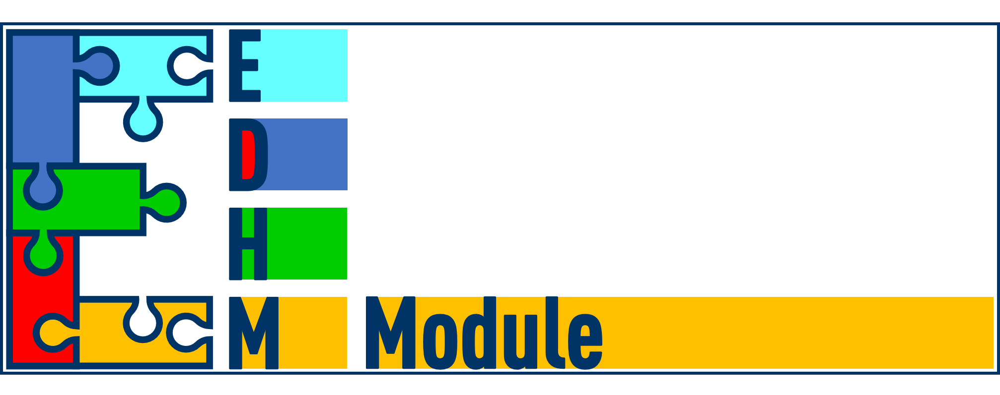
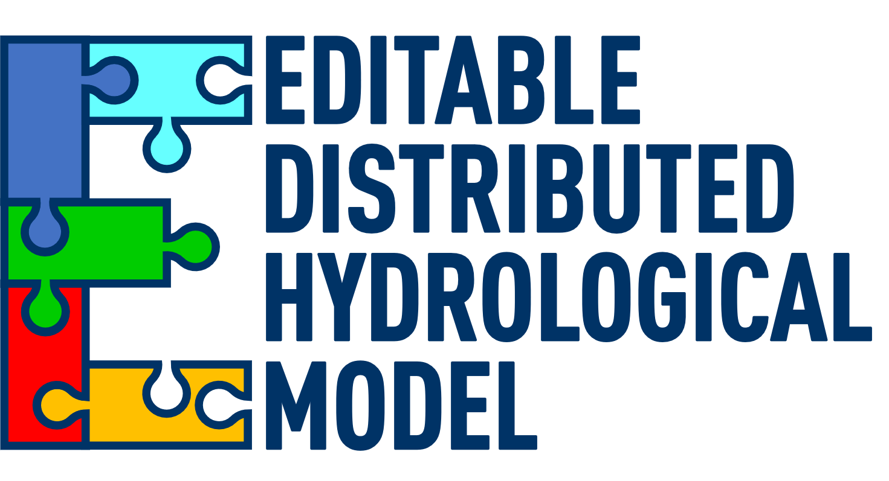

--- 
title: "Editable Distributed Hydrological Model"
author: "Kan Lei"
date: "`r Sys.Date()`"
site: bookdown::bookdown_site
output: bookdown::gitbook
documentclass: book
bibliography: [book.bib, packages.bib]
biblio-style: apalike
link-citations: yes
github-repo: rstudio/bookdown-demo
description: "This is a minimal example of using the bookdown package to write a book. The output format for this example is bookdown::gitbook."
---
```{r setup, include=FALSE}
knitr::opts_chunk$set(echo = TRUE, warning = F)
library(HMtools)
library(EDHM)
library(knitr)
library(kableExtra)
library(purrr)
library(bookdown)
```

```{r funktion, echo=F}
write_Rmd_Module <- function(module_name, file_name){
  string001 = 'This MODULE reference to the Literature: `r Data_'
  string002 = '$ref_title` [@`r Data_'
  string003 = '$ref_bib`].\n'
  string01 = 'n_In <- as.numeric(map(Data_'
  string02 = '$InData, length))\n'
  string03 = 'Group_Name <- reduce(map2(names(Data_'
  string04 = '$InData), n_In, rep), c)\n'
  string05 = 'Variable_Name <- reduce(map(Data_'
  string06 = '$InData, names), c)\n'
  string30 = 'Unit_ <- as.character(map2(Group_Name, Variable_Name, function(a, b) Unit_dataset[[a]][[b]]))\n'
  string31 = 'Des_ <- as.character(map2(Group_Name, Variable_Name, function(a, b) Des_dataset[[a]][[b]]))\n'
  string07 = 'In_'
  string08 = ' <- data.frame(Group = Group_Name, Variable = Variable_Name, Unit = Unit_, Description = Des_)\n'
  string11 = 'P_Name <- names(Data_'
  string12 = '$Param)\n'
  string13 = 'P_min <- as.numeric(map(Data_'
  string14 = '$Param, function(a) a[1]))\n'
  string15 = 'P_max <- as.numeric(map(Data_'
  string16 = '$Param, function(a) a[2]))\n'
  string161 = 'P_unit <- as.character(map(Data_'
  string162 = '$Param, function(a) a[3]))\n'
  string163 = 'P_des <- as.character(map(Data_'
  string164 = '$Param, function(a) a[4]))\n'
  string17 = 'P_'
  string18 = ' <- data.frame(Paramter = P_Name, Min = P_min, Max = P_max, Unit = P_unit, Description = P_des)\n'
  string21 = 'n_Out <- as.numeric(map(Data_'
  string22 = '$OutData, length))\n'
  string23 = 'Group_Name <- reduce(map2(names(Data_'
  string24 = '$OutData), n_Out, rep), c)\n'
  string25 = 'Variable_Name <- reduce(map(Data_'
  string26 = '$OutData, names), c)\n'
  string27 = 'Out_'
  string28 = ' <- data.frame(Group = Group_Name, Variable = Variable_Name, Unit = Unit_, Description = Des_)\n'
  string0 = '```{r t_'
  string1 = ', echo = FALSE}\n'
  string2 = 'kable('
  string3 = ', caption = \''
  # string4 = '\', row.names = F) %>% collapse_rows(1) %>% kable_styling(latex_options = \"hold_position\")\n'
  string4 = ', row.names = F) %>% collapse_rows(1) %>% kable_styling(latex_options = \"hold_position\")\n'
  string5 = '```\n\n'

  string <- paste0('### ', module_name, ' {#', module_name, '}\n\n',
                   string001, module_name, string002, module_name, string003, '\n',
                   '***InData***\n\n',
         string0, string07, module_name, string1,
         string01, module_name, string02,
         string03, module_name, string04,
         string05, module_name, string06,
         string30, string31,
         string07, module_name, string08,
         string11, module_name, string12,
         string13, module_name, string14,
         string15, module_name, string16,
         string161, module_name, string162,
         string163, module_name, string164,
         string17, module_name, string18,
         string21, module_name, string22,
         string23, module_name, string24,
         string25, module_name, string26,
         string30, string31,
         string27, module_name, string28,
         string2, string07, module_name, string4,
         string5,
         '***Param***\n\n',
         string0, string17, module_name, string1,
         string2, string17, module_name, string4,
         string5,
         '***OutData***\n\n',
         string0, string27, module_name, string1,
         string2, string27, module_name, string4,
         string5,
         'Return to the [Overview](#module) of MODULEs.\n')
  write(string, file = file_name, append = T)
}
write_Rmd_Process <- function(process_name, Module_list, file_name){
  string <- paste0('## ', process_name, ' {#', process_name, '}\n')
  write(string, file = file_name, append = T)
  Module_name <- Module_list[[process_name]]
  map(Module_name, write_Rmd_Module, file_name = file_name)
}
write_Rmd_Module_all <- function(Process_list, Module_list, file_name){
  string01 <- '# Basic Information of MODULEs {#module}\n\n\n\nOverview of **MODULEs**\n\n```{r t_Md_table, echo = FALSE}\nkable(df_Md_table, row.names = F) %>% collapse_rows(1) %>% kable_styling(latex_options = "hold_position")\n```\n'
   write(string01, file_name)
   map(Process_list, write_Rmd_Process, Module_list, file_name)
}

```


```{r dataset, echo = F}
Process_list <- c('ReferenceET',
                  'ActualET',
                  'SNOW',
                  'BASEFLOW',
                  'INTERCEPTION',
                  'InfiltratRat',
                  'Infiltration',
                  'RUNOFF',
                  'GROUNDWATER',
                  'ROUTE')
Module_list <- map(Process_list, function(m) as.character(methods(m)))
names(Module_list) <- Process_list

Module_list$ROUTE <- c("ROUTE.G2RES", "ROUTE.Gr4j")

table_Md <- as.character(map(Process_list,
                             function(pc, md)
                               paste(paste0('[', md[[pc]], '](#', md[[pc]], ') '), collapse = '| '),
                             md = Module_list))
df_Md_table <- data.frame(PROCESS = Process_list, MODULE = table_Md)
write_Rmd_Module_all(Process_list, Module_list, '03-module.Rmd')

```


# The Document and the EDHM Package {-}

## The Document {-}

This document is the use guide for EDHM and some other concept about the hydrological models (**HM**) building. In Chapter \@ref(base) explain the basic concept of hydrological cycle and the important concept and idea of EDHM. In chapter \@ref(develop) show the workflow of using a hydrological model with EDHM and the way to explain a new model. Chapter \@ref(module) and \@ref(model) show the basic information, e.g. input data, parameters and output data of every module or model.

## EDHM {-}



EDHM is a R package for hydrological models in order to simplify the models building, specially the distributed hydrological model. In the package contain many complete **MODEL** that can used directly, and many **MODULE** that can a new MODEL to building. All of the MODELs and MODULEs are build with matrix-arithmetic, that can good deal with the distributed situation. In the package there are many tools to calibrate the parameters or build a new MODEL or a new MODULE. The Package is only in GitHub published, for the first time use, please install the package [EDHM](https://github.com/LuckyKanLei/EDHM) and [HMtools](https://github.com/LuckyKanLei/HMtools) use the following code:

```
install.packages("devtools")
devtools::install_github("LuckyKanLei/HMtools")
devtools::install_github("LuckyKanLei/EDHM")
```
The summary of the Processes and Modules show in the following table:

```{r t_1_Md_table, echo = FALSE}
kable(df_Md_table, row.names = F) %>% collapse_rows(1) %>% kable_styling(latex_options = "hold_position")
```

